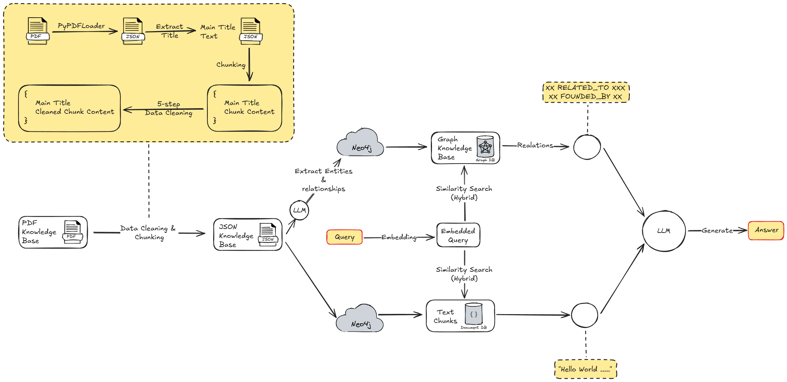

# GraphRAG-Neo4j

This repository provides a pipeline for processing, uploading, and querying scientific literature in PDF format. The pipeline extracts entities and relationships from the literature and stores them in a Neo4j knowledge graph for retrieval and analysis.


## Features

1. **PDF Preprocessing**:
    - Cleans and splits PDF files into text chunks.
    - Extracts main titles and section headings.
    - Removes content after references.
    - Saves processed chunks as JSON files.

2. **Data Upload to Neo4j**:
    - Uses an LLM (Ollama) to extract entities and relationships from the literature chunks.
    - Uploads entities and relationships to a Neo4j knowledge graph.
    - Builds a vector index for efficient retrieval.

3. **Interactive Question Answering**:
    - Provides an interactive interface for querying the knowledge graph.
    - Supports hybrid search using full-text and vector-based retrieval.
    - Extracts structured and unstructured data from the knowledge graph.

## Prerequisites

- **Python 3.x** installed
- **Neo4j** running on your local or remote server
- **Required Python libraries**:
    - `neo4j`
    - `langchain`
    - `tqdm`
    - `PyPDF2`
    - `ollama_functions`
    - `pydantic`
    - `json`

You can install the necessary Python libraries with the following command:

```bash
pip install neo4j langchain langchain-community langchain_experimental tqdm PyPDF2 pydantic subprocess sys json
```

## Installation

1. Clone the repository:
    ```bash
    git clone https://github.com/QiwTan/GraphRAG-Neo4j.git
    ```
2. Navigate to the repository directory:
    ```bash
    cd <repository_directory>
    ```

3. Create a configuration file by editing `config.py`:
    ```python
    # config.py
    NEO4J_URI = "neo4j://your_neo4j_host:7687"
    NEO4J_USERNAME = "your_neo4j_username"
    NEO4J_PASSWORD = "your_neo4j_password"

    INPUT_PDF_FOLDER = "PDF_data/"
    OUTPUT_JSON_FOLDER = "PDF_json/chunked/"
    CHUNK_SIZE = 1000
    CHUNK_OVERLAP = 200

    LLM_MODEL = "llama3.1:latest"
    LLM_TEMPERATURE = 0
    EMBEDDING_MODEL = "nomic-embed-text:latest"
    ```

4. Ensure Neo4j is running and accessible using the credentials provided in the `config.py`.

## Usage

### 1. Preprocess PDFs

To preprocess PDFs and generate JSON chunks, run the following command:

```bash
python preprocess_pdfs.py
```

This script reads all PDF files from the `PDF_data/` directory, cleans and splits them, and saves the output as JSON chunks in the `PDF_json/chunked/` directory.

### 2. Upload Data to Neo4j

To upload the processed data to Neo4j, run the following command:

```bash
python upload_to_neo4j.py
```

This script extracts entities and relationships from the JSON chunks using the LLM and uploads them to Neo4j, creating a knowledge graph.

### 3. Hybrid QA

To start the Hybrid question-answering interface, run:

```bash
python hybrid_qa.py
```

This will allow you to ask questions related to the uploaded literature and get detailed responses based on the knowledge graph.

#### Output Example

```bash
请输入您的问题: what is kat?
Search query: what is kat?
Extracted Entities: ['kat']
Received notification from DBMS server: {severity: WARNING} {code: Neo.ClientNotification.Statement.FeatureDeprecationWarning} {category: DEPRECATION} {title: This feature is deprecated and will be removed in future versions.} {description: CALL subquery without a variable scope clause is now deprecated. Use CALL () { ... }} {position: line: 1, column: 1, offset: 0} for query: "CALL { CALL db.index.vector.queryNodes($index, $k, $embedding) YIELD node, score WITH collect({node:node, score:score}) AS nodes, max(score) AS max UNWIND nodes AS n RETURN n.node AS node, (n.score / max) AS score UNION CALL db.index.fulltext.queryNodes($keyword_index, $query, {limit: $k}) YIELD node, score WITH collect({node:node, score:score}) AS nodes, max(score) AS max UNWIND nodes AS n RETURN n.node AS node, (n.score / max) AS score } WITH node, max(score) AS score ORDER BY score DESC LIMIT $k RETURN reduce(str='', k IN ['text'] | str + '\\n' + k + ': ' + coalesce(node[k], '')) AS text, node {.*, `embedding`: Null, id: Null, `text`: Null} AS metadata, score"
Structured data:
        Kat - HAS_CHALLENGE -> Gr-Kan
Kat - EVALUATED_ON -> Imagenet1K
Kat - APPLIED_TO -> Language Models
Kat - PERFORMS -> Semantic Segmentation
Kat - PERFORMS -> Object Detection
Kat - PERFORMS -> Image Recognition
Kat - USES -> Adamw
Kat - INTEGRATES -> Gr-Kan
Kat - LOADS_PRETRAINED_WEIGHTS_FROM -> Vit
Kat - LOADS -> Vit Models
Kat - OUTPERFORMS -> Transformers
Kat - APPLIED_TO -> Semantic Segmentation
Kat - APPLIED_TO -> Object Detection
Kat - APPLIED_TO -> Image Recognition
Kat - OUTPERFORMS -> Mlp-Based Transformers
Kat - COMPATIBLE_WITH -> Gpus
Kat - REPLACES -> B-Spline Functions
Gr-Kan - IS_A_TYPE_OF -> Kat
Group-Rational Kan - ENHANCES -> Kat
Kat Model - TRANSFERS_WEIGHTS_FROM -> Vit
Kat Approach - OPTIMIZES -> Transformer Architectures
Vitdet-Based Mask R-Cnn Model - EMPLOYS -> Kat Approach
Ms-Coco2017 - EVALUATED_ON -> Kat Approach
Kat-T - RUNS_ON -> Nvidia A5000 Gpu
Kat-T - OUTPERFORMS -> Gelu
Kat-T - COMPARED_WITH -> Pau
Kat-T - OUTPERFORMED -> Deit-B
Kat-T - COMPARED_WITH -> Prelu
Kat-T - COMPARED_WITH -> Relu
Kat-T - OUTPERFORMED -> Deit-S
Kat-T - COMPARED_WITH -> Gelu
Kat-T - COMPARED_WITH -> Silu
Imagenet-1K Dataset - EVALUATES -> Kat-T
Nvidia A5000 Gpu - MEASURES -> Kat-T
Gr-Kan - ENHANCES -> Kat-T
Kat-B - ACHIEVES_ACCURACY_ON -> Imagenet-1K
Kat-Tiny - CONFIGURED_AS -> Vit
Kat Models - EVALUATED_ON -> Imagenet-1K
Kat Models - OUTPERFORM -> In-1K Dataset
Vit Model - INITIALIZED_USING -> Kat Models
Vit-T/S + Kan - COMPARE -> Kat Models
Vit-L + Kan - COMPARE -> Kat Models
Vit+Kan - USES -> Imagenet-Scale Training
Vit+Kan - EVALUATION -> Imagenet-Scale Training
Vit + Kan - REPLACES -> Mlp
Kat-T Model - USES -> Rational Initialization
Identity - Swish Initialization - IS_USED_BY -> Kat-T Model
Kat-S Model - OUTPERFORM -> Deit-S Model
Vit-L + Kan - COMPARE -> Kat Models
Kan - USES_STRATEGY -> Grouping Strategy
Kan - COMPARE -> Mlp
Kan - EXTENSION -> Group Kan
Kan - COMPARED_TO -> Mlp
Kan - EMPLOYS -> B-Spline
Kan - USES -> B-Spline
Gr-Kan - COMPARE -> Kan
B-Spline With De Boor-Cox Iterative Formulation - USED_IN -> Kan
Mlp - CONTRASTS_WITH -> Kan
Gpu - MANAGES -> Kan
Kolmogorov–Arnold Transformer (Kat) - COMPARISON -> Vit Models
Kolmogorov–Arnold Transformer (Kat) - EVALUATION -> Imagenet-Level Training
Kolmogorov–Arnold Transformer (Kat) - EXTENDS -> Vit
Variance-Preserving Initialization - COMPONENT -> Kolmogorov–Arnold Transformer (Kat)
Kolmogorov-Arnold Transformer (Kat) - INTEGRATES -> Kolmogorov-Arnold Networks (Kans)
Kolmogorov-Arnold Transformer (Kat) - USES -> Kan Layers
Kolmogorov-Arnold Transformer (Kat) - REPLACES -> Mlp Layers
Kolmogorov-Arnold Transformer (Kat) - INTEGRATES -> Kans
Kolmogorov-Arnold Transformer (Kat) - TRAINS_ON -> Imagenet
Kolmogorov-Arnold Transformer (Kat) - INTEGRATES -> Kolmogorov-Arnold Network (Kan) Layers
Kolmogorov-Arnold Transformer (Kat) - REPLACES -> Multilayer Perceptron (Mlp) Layers
Group-Rational Kan (Gr-Kan) - IMPROVES -> Kolmogorov-Arnold Transformer (Kat)
Vit-T/S + Kan - COMPARE -> Kat Models
Prelu - IMPROVES -> Pau
Kat-T - COMPARED_WITH -> Pau
Kans - COMPARES_TO -> Mlps
Kans - COMPARISON -> Mlps
Gr-Kan - MERGES_ADVANTAGES_FROM -> Kans
Kolmogorov-Arnold Transformer (Kat) - INTEGRATES -> Kans
B-Spline Functions - PART_OF -> Kans
Vision Transformer (Vit) - INTEGRATION -> Kans
Kan Paper - EXTENSION -> Group Kan
Kan Layers - PART_OF -> Transformer Block
Transformer Block - CONTAINS -> Kan Layers
Kolmogorov-Arnold Transformer (Kat) - USES -> Kan Layers
Group Kan - COMPARISON -> Mlp
Group Kan - DISTINCTION -> Mlp
Group Kan - APPLICATION -> Kan-Based Models
Group Kan - SHARES -> Gr-Kan
Kan - EXTENSION -> Group Kan
Kan Paper - EXTENSION -> Group Kan
Gr-Kan - MERGES_ADVANTAGES_FROM -> Kans
Gr-Kan - MERGES_ADVANTAGES_FROM -> Mlps
Gr-Kan - IS_A_TYPE_OF -> Kat
Gr-Kan - LEVERAGES_ADVANTAGES_FROM -> Mlp
Gr-Kan - ENHANCES -> Kat-T
Gr-Kan - INTEGRATED_IN -> Transformer Architectures
Gr-Kan - INCLUDES -> Linear Layer
Gr-Kan - OPERATES_ON -> Input Vector X
Gr-Kan - COMPARE -> Kan
Fourier Transformations - ALTERNATIVE_TO -> Gr-Kan
Rational Functions - USED_IN -> Gr-Kan
Wavelet Transforms - ALTERNATIVE_TO -> Gr-Kan
Gaussian Radial Bases - ALTERNATIVE_TO -> Gr-Kan
Kat - HAS_CHALLENGE -> Gr-Kan
Kat - INTEGRATES -> Gr-Kan
Variance-Preserving Initialization - INITIALIZES -> Gr-Kan
Group Kan - SHARES -> Gr-Kan
Rational Activation - EMPLOYS -> Gr-Kan
Group-Rational Kan (Gr-Kan) - UTILIZES -> Rational Activation Functions
Group-Rational Kan (Gr-Kan) - UTILIZES -> Group-Based Parameter Sharing
Group-Rational Kan (Gr-Kan) - UTILIZES -> Variance-Preserving Initialization
Group-Rational Kan (Gr-Kan) - IMPROVES -> Kolmogorov-Arnold Transformer (Kat)
Group-Rational Kan - BASED_ON -> Gb10
Group-Rational Kan - ADAPTED_FROM -> Hzrs15
Group-Rational Kan - ENHANCES -> Kat
Msk20 - USES -> Group-Rational Kan
Agh24 - CITES -> Group-Rational Kan
Tel17 - CITES -> Group-Rational Kan
Bnt20 - CITES -> Group-Rational Kan
Lh93 - CITES -> Group-Rational Kan
Gr-Kan Layer - MIMICS -> Swish Function
Gr-Kan Layer - CONSISTS_OF -> Linear Layer
Gr-Kan Layer - CONSISTS_OF -> Group-Wise Rational Layer
Gr-Kan Layer - HAS_ONE-TO-ONE_WEIGHT_MAPPING_WITH -> Mlp In Vit
Mlp - INITIALIZED_FROM -> Gr-Kan Layer
Vit Model - CLONED_FROM -> Gr-Kan Layer
Kan-Based Models - IMPROVEMENT -> Gpu Efficiency
Kolmogorov-Arnold Representation Theorem - INSPIRATION -> Kan-Based Models
Group Kan - APPLICATION -> Kan-Based Models
Vit - TRAINED_ON -> Imagenet-1K
Kat-Tiny - CONFIGURED_AS -> Vit
Kat Model - TRANSFERS_WEIGHTS_FROM -> Vit
Kat - LOADS_PRETRAINED_WEIGHTS_FROM -> Vit
Kolmogorov–Arnold Transformer (Kat) - EXTENDS -> Vit
Kolmogorov-Arnold Transformer (Kat) - INTEGRATES -> Kolmogorov-Arnold Network (Kan) Layers
Kolmogorov-Arnold Networks (Kans) - ALTERNATIVE -> Mlps
Kolmogorov-Arnold Networks (Kans) - INTEGRATION -> Transformers
Kolmogorov-Arnold Networks (Kans) - THEORETICAL_BASIS_FOR -> Lwv+24
Kolmogorov-Arnold Transformer (Kat) - INTEGRATES -> Kolmogorov-Arnold Networks (Kans)
B-Spline Curves - PARAMETERIZATION -> Kolmogorov-Arnold Networks (Kans)
Vit Model - INITIALIZED_USING -> Kat Models
Vit Model - CLONED_FROM -> Gr-Kan Layer
Kolmogorov–Arnold Transformer (Kat) - COMPARISON -> Vit Models
Kat - LOADS -> Vit Models
Safe Padé Activation Unit (Pau) - USED_IN -> Rational Function
Vision Transformer (Vit) - INTEGRATION -> Kans
Gr-Kan Layer - HAS_ONE-TO-ONE_WEIGHT_MAPPING_WITH -> Mlp In Vit
        Unstructured data:
        
text: integrated into vision transformers, replacing MLP layers to achieve superior performance. Furthermore, our designs allow KAT to load pre-trained weights from ViT models and continue training to achieve even better results. We empirically validate KAT across a range of vision tasks, including image recognition, object detection, and semantic segmentation. The results demonstrate that KAT outperforms traditional MLP-based transformers, achieving enhanced performance with comparable computational requirements. As illustrated in Figure 1, KAT-B achieves 82.3% accuracy on ImageNet-1K, surpassing the ViT model of the same size by 3.1%. When initialized with pre-trained weights from ViT, the performance further improves to 82.7%. The contributions of our paper are threefold. First, we conduct a thorough analysis of the challenges in scaling KAN-based models, particularly focusing on inefficiencies in base functions, parameterization, and weight initialization. Based on this analysis, we propose a set of solutions: rational activation functions tailored for GPU efficiency, Group KAN to reduce#Document 
text: outperforms traditional MLP-based transformers. We demonstrate the advantages of KAT across various tasks, including image recognition, object detection, and semantic segmentation. It consistently enhances performance over the standard transformer architectures of different model sizes. Our code is openly available at https://github.com/Adamdad/kat . 1 Introduction Transformers have become the de facto architecture in deep learning, widely adopted in computer vision [ DBK+21] and natural language processing [ VSP+17]. At their core, transformers are built upon two fundamental components: attention 1arXiv:2409.10594v1 [cs.LG] 16 Sep 2024 modules and multi-layer perceptrons (MLPs). Although significant research has focused on replacing the traditional attention mechanism with alternative operations [ LLC+21,LMW+22,THK+21], these variants still lean heavily on MLPs. Surprisingly, there have been relatively few efforts [Sha20] aimed at enhancing MLPs themselves. Opening up the box, MLPs are composed of stacked linear layers coupled with non-linear activations. What makes#Document 
text: Kolmogorov-Arnold Networks (KANs) into transformers, addressing key challenges associated with large-scale training scenarios. Our proposed Group-Rational KAN (GR-KAN) variant, with its rational activation functions, group-based parameter sharing, and variance-preserving initialization, demonstrated significant improvements in computational efficiency and scalability. Through extensive experiments on vision tasks, including image recognition, object detection, and semantic segmentation, KAT outperformed traditional MLP-based transformers, achieving superior accuracy on ImageNet1K while maintaining comparable computational demands. Discussion. Our study highlights KAT’s potential as a good alternative to MLP-based transformers, especially in large-scale vision tasks. This integration introduces exciting opportunities for broad applications. For example, employing KAT architectures might help development of language models. However, KAT is not without its challenges. A primary concern is running speed. Even with the CUDA optimized code, the rational function is still slower than plain activation like ReLU and GELU. Another issue is the stability when using rational#Document 
text: or reinforcement learning, could unlock new opportunities for performance gains. Further research could also investigate hybrid models [ YZL+22,YSZ+23], or adaptive mechanisms for dynamically selecting between KAN and MLP layers based on the complexity of the task, thereby optimizing resource utilization. Finally, addressing the remaining scalability challenges, particularly in terms of memory footprint and inference speed, will be crucial for deploying KAT in real-world applications at scale. Acknowledgement We would like to acknowledge that computational work involved in this research work is partially supported by NUS IT’s Research Computing group using grant numbers NUSREC-HPC-00001. We thank Weihao Yu, Qiuhong Shen and Runpeng yu for valuable discussions.#Document 
text: architectures might help development of language models. However, KAT is not without its challenges. A primary concern is running speed. Even with the CUDA optimized code, the rational function is still slower than plain activation like ReLU and GELU. Another issue is the stability when using rational functions in neural networks. The higher order gradients for 𝑎𝑚and𝑏𝑛can become unstable because of their dependence on the input power. Integrating these functions into the backpropagation process could introduce complications. Additionally, it is important to acknowledge that our GR-KAN represents a hybrid model. On the one hand, GR-KAN is a KAN layer with shared edges and a rational base function. On the other hand, it can be interpret as MLP with a redesigned activation placed before the linear layer. It leverages the computational simplicity of MLPs but maintains some characteristics of KANs. However, GR-KAN is not a pure KAN model. Instead, it merges advantages from both systems to enhance overall functionality. Future Work. There are multiple directions of KAT for future research. One potential area of exploration is to find alter-
        
回答: KAT stands for Kolmogorov-Arnold Transformer, which is a novel transformer architecture that replaces traditional multi-layer perceptrons (MLPs) with Kolmogorov-Arnold Networks (KANs). KANs are neural networks that use rational functions as activation functions, allowing them to learn more complex and non-linear relationships between inputs and outputs.

The document discusses the challenges of scaling KAN-based models, particularly in terms of inefficiencies in base functions, parameterization, and weight initialization. To address these challenges, the authors propose a set of solutions, including:

1. Rational activation functions tailored for GPU efficiency
2. Group KAN to reduce parameters and improve computational efficiency
3. Variance-preserving initialization to stabilize training

The proposed GR-KAN (Group-Rational KAN) variant demonstrates significant improvements in computational efficiency and scalability. Through extensive experiments on vision tasks, including image recognition, object detection, and semantic segmentation, KAT outperforms traditional MLP-based transformers, achieving superior accuracy on ImageNet-1K while maintaining comparable computational demands.

The authors also discuss the potential applications of KAT, including its use in large-scale vision tasks, language models, and reinforcement learning. However, they also acknowledge the challenges associated with KAT, such as running speed and stability when using rational functions in neural networks.

Methodology:
The authors conducted a thorough analysis of the challenges in scaling KAN-based models and proposed a set of solutions to address these challenges. They then implemented the GR-KAN variant and evaluated its performance on various vision tasks.

Results:
The results show that KAT outperforms traditional MLP-based transformers, achieving superior accuracy on ImageNet-1K while maintaining comparable computational demands.

Conclusions:
The authors conclude that KAT is a promising alternative to traditional MLP-based transformers, particularly in large-scale vision tasks. However, they also acknowledge the challenges associated with KAT and highlight the need for further research to address these challenges.

Future Work:
The authors propose several directions for future research, including exploring hybrid models, adaptive mechanisms for dynamically selecting between KAN and MLP layers, and addressing remaining scalability challenges.
```

### 4. Run All Steps

To run the entire workflow (preprocessing, upload, and QA), execute the following command:

```bash
python main.py
```

Follow the on-screen prompts to select the operation you want to perform.

## File Structure

```
├── config.py              # Configuration file with paths and Neo4j credentials
├── main.py                # Main script to run all steps
├── preprocess_pdfs.py     # Preprocesses PDF files into JSON chunks
├── upload_to_neo4j.py     # Uploads JSON chunks to Neo4j
├── interactive_qa.py      # Interactive question-answering script
├── PDF_data/              # Folder containing input PDF files
└── PDF_json/chunked/      # Folder containing output JSON chunks
```